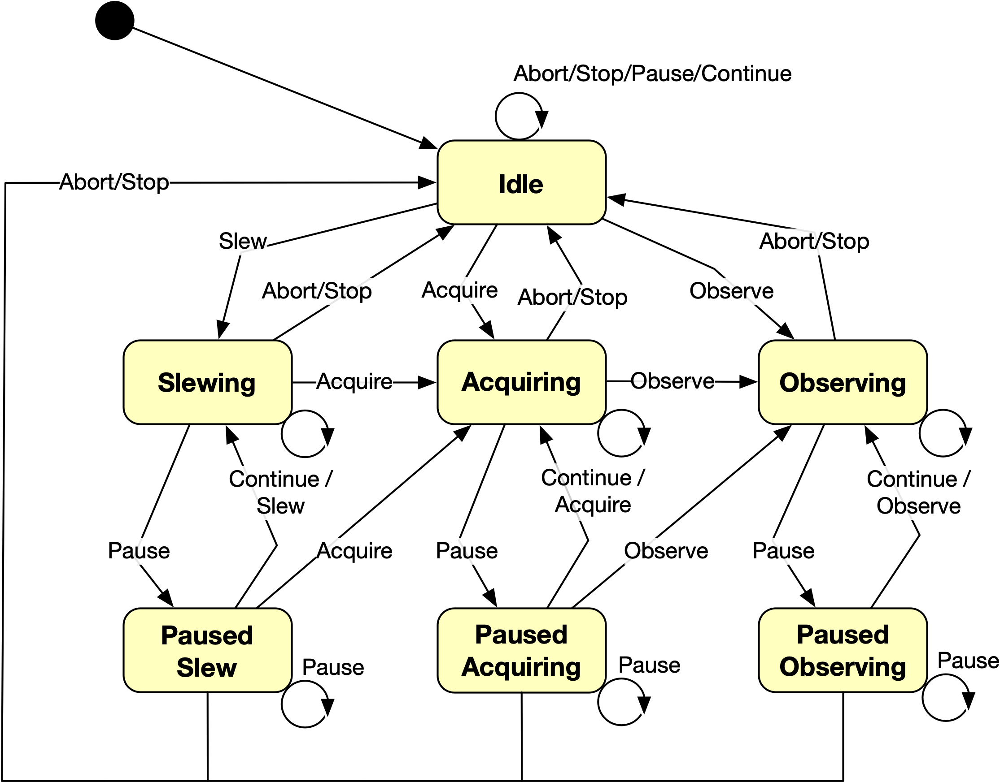

# Observe API Notes

This document sketches out a few ideas for the Observe / Execution API for discussion.  Following GraphQL itself, there are query, mutation and subscription aspects to the API.

* TODO: somehow need to figure out how to express break points
* TODO: executed steps shouldn't lose the atom information
* TODO: a word or two at least about subscriptions


## Query API

Beginning with the query API, we'll introduce an `Execution` type to house runtime and execution related data for an observation.  The client accesses it via an observation id.  Since the given observation may not in fact exist, the result is optional.


```
type Query {
  …
  execution(
    observationId: ObservationId!
  ): Execution
  …
}
```

The first challenge for the API is that each instrument has its own configuration details and features.  This implies that the API will have a combination of instrument-specific parts along with generic data.  For example, `Execution` can have an instrument-specific `InstrumentConfiguration` along with time accounting and event data that work with any instrument.

```
enum InstrumentType {
  …
  GMOS_N
  GMOS_S
  …
}

interface InstrumentConfiguration {
  instrument: InstrumentType!
}

type GmosNorthConfiguration implements InstrumentConfiguration {
  …
}

type GmosSouthConfiguration implements InstrumentConfiguration {
  …
}

type Execution {
  config: InstrumentConfiguration!
  time:   TimeAccounting!
  events: ExecutionEvents!
  state:  ExecutionState!
}
```

`TimeAccounting` (not discussed further here) will have planned time estimates for the sequence as a whole and for the remaining steps, categorized according to charge classes (`PROGRAM` vs `PARTNER` vs `NON_CHARGED`) along with detailed execution time tracking.  The `ExecutionEvents` type provides mechanisms for querying and filtering events based on time ranges and event types.  Observe will be the source for most of this information.  The `state` is only hinted at here but the idea is that it describes the runtime state of an observation.  The mutation section covers events in more detail.


To do anything with the instrument configuration (other than check the instrument type), the query will have to match on the specific configuration type.

```
query Execution($observationId: ObservationId!) {
  execution(observationId: $observationId) {
    config {
      instrument
      ... on GmosNorthConfiguration {
        static {
          nodAndShuffle {
            posA {
              p { arcseconds }
              q { arcseconds }
            }
            posB {
              p { arcseconds }
              q { arcseconds }
            }
          }
        }
      }
    }
  }
}

```

Most instrument configurations will likely have the same structure, albeit with different individual static and dynamic (step) configurations.  For example,

```
type GmosNorthAtom {
  steps: [GmosNorthStep!]
}

type GmosNorthExecutedStep {
  step:     GmosNorthStep!
  datasets: [Dataset!]
}

type GmosNorthConfiguration implements InstrumentConfiguration {
  instrument:         InstrumentType!
  static:             GmosNorthStaticConfig!
  nextAtom:           GmosNorthAtom
  executed:           [GmosNorthExecutedStep!]
  estimatedRemaining: [GmosNorthAtom!]
}

```

The manual configuration API docs in [staging](https://lucuma-odb-staging.herokuapp.com/playground.html) detail the `GmosNorthStaticConfig` and `GmosNorthStep` with their filters, focal plane unit options, etc.  Various planning documents describe the "atom" concept. It encapsulates the idea of an "indivisible" mini-sequence of steps.  For example, a science dataset along with an accompanying flat might form an atom in a longslit sequence.  The science data without the flat (or vice versa) is not useful so splitting the atom is at least strongly discouraged.

The `executed` steps and `estimatedRemaining` atoms are necessary for the various UIs to give a full picture of how the sequence has executed so far and how we expect the sequence may unfold.  Observe will always pull the next atom to execute, one by one, _as the sequence runs_ via the `nextAtom` field.  This implies that the server has knowledge of the state of a running observation so that it can compute the next atom (if any).


## Mutation API

The mutation API allows adding execution events as an observation progresses.  Each observation has, at least conceptually, a runtime state based on its progress and the events received so far.  The idea is to share this state across the seqexec, TCC, chronicle, the scheduling UI etc.

We categorize execution events by level.  Going from top to bottom then: observation vs. individual step vs. dataset-specific.  In the past steps were 1:1 with datasets but newer instruments may produce many datasets per step.  All event levels have in common that they happen at a particular time and that they reference a particular observation:

```
interface ExecutionEvent {
  generated:     Timestamp!
  received:      Timestamp!
  observationId: ObservationId!
}
```

where `Timestamp` is some custom scalar identifying a date and time.  The caller (typically Observe or Engage) supplies the `generated` timestamp when it adds the event.  The database server records the `received` timestamp when it gets the request.  While this distinction may not be important, it would permit the caller to hold and batch events without losing information about when they occurred.  At any rate, if the caller is supplying a timestamp then in theory it could be anything so it seems useful to also record the reception timestamp.

Starting at the observation level then, we can picture a state machine through which an observation moves as it executes.  It isn't clear yet what the states and transitions will be but as a starting point, something like this finite state machine (somewhat incomplete) may suffice:



These are observation states and their transitions.  Note that explicit events inform the server when to transition to acquiring and then to observing.  At least at first, we don't envision automating target acquisition.  Instead the user will have to tell Observe when the target is acquired so that it in turn can tell the server to switch to the main science sequence.  Acquiring and observing are similar in that they both involve executing steps and producing datasets, but the nature of the steps themselves will differ.


```
enum ObservationEventEnum {
  OBS_ABORT
  OBS_ACQUIRE
  OBS_CONTINUE
  OBS_OBSERVE
  OBS_PAUSE
  OBS_SLEW
  OBS_STOP
}

enum ObservationStateEnum {
  ACQUIRING
  IDLE
  OBSERVING
  PAUSED_ACQUIRING
  PAUSED_OBSERVING
  PAUSED_SLEW
  SLEWING
}

type ObservationEvent implements ExecutionEvent {
  eventId:       EventId!
  eventType:     ObservationEventEnum!

  generated:     Timestamp!
  received:      Timestamp!
  observationId: ObservationId!
}
```

Adding an observation event requires creating an `AddObservationEventInput` and passing it to the corresponding mutation.  The `AddObservationEventInput` repeats some of the information in the `ObservationEvent` itself, but having a separate input (and payload result) is a recommended practice in general.  In particular, it greatly facilitates schema evolution.

```
type Mutation {
  …
  addObservationEvent(
    input: AddObservationEventInput!
  ): AddObservationEventPayload!
  …
}

type AddObservationEventInput {
  eventType:     ObservationEventEnum!
  timestamp:     Timestamp!
  observationId: ObservationId!
}
```

The server returns an `AddObservationEventPayload` as a result. Just as for separate `*Input` types, separate `*Payload` results simplify schema evolution.

```
interface Error {
  message: String!
  code:    ErrorCode!
}

union AddObservationEventPayload =
  AddObservationEventSuccess   |
  UnknownObservationIdError |
  …

type AddObservationEventSuccess {
  event: ObservationEvent!
  state: ExecutionState!
}

type UnknownObservationIdError implements Error {
  observationId: ObservationId!
  message:       String!
  code:          ErrorCodeEnum!
}

type ErrorCodeEnum {
  UNKNOWN_OBSERVATION_ID
  …
}
```

Details of the specific error types and `ErrorCodeEnum`s are pending but the idea in general is that raising errors to the GraphQL type system level documents them more clearly and allows the client to respond appropriately.  An example of using this mutation:

```
mutation AddObservationEvent($input: AddObservationEventInput!) {
  addObservationEvent(input: $input) {
    ... on AddObservationEventSuccess {
      event {
        eventId
      }
      state {
        sequenceState
      }
    }
    ... on Error {
      message
      code
    }
  }
}

```

While acquiring or observing, individual sequence steps execute in succession.  Each step passes through a configuration stage that applies offset positions and/or instrument updates followed by a collecting phase that produces one or more datasets.  While collecting, a stop or abort command may cause a transition out of acquiring or observing altogether.  The observation execution state machine will need to take this into account.  The state of an observation at any time is the combination of the sequence state and the step state (if any).

```
enum StepEventEnum {
  STEP_CONFIGURE
  STEP_COLLECT
  STEP_END
}

enum StepStateEnum {
  PENDING
  CONFIGURING
  COLLECTING
}

type ExecutionState {
  observationState: ObservationStateEnum!
  stepState:        StepStateEnum
}

type StepEvent implements ExecutionEvent {
  eventId:       EventId!
  eventType:     StepEventEnum!

  generated:     Timestamp!
  received:      Timestamp!
  observationId: ObservationId!
  stepId:        StepId!
}
```

Step event addition follows the same pattern as sequence events with `Input` and `Payload` types and a `mutation`.

```
type Mutation {
  …
  addStepEvent(
    input: AddStepEventInput!
  ): AddStepEventPayload!
  …
}

type AddStepEventInput {
  eventType:     StepEventEnum!
  timestamp:     Timestamp!
  observationId: ObservationId!
  stepId!        StepId!
}

union AddStepEventPayload =
  AddStepEventSuccess       |
  UnknownObservationIdError |
  UnknownStepIdError        |
  …

type AddStepEventSuccess {
  event: StepEvent!
  state: ExecutionState!
}
```

Finally each step may produce more than one dataset, and each individual dataset passes through several stages on its way to disk: exposure, readout, write.  Recording events for each stage of a dataset will give us greater insight into time estimation accuracy, help with debugging, and generally make execution more transparent to users.

```
enum DatasetEventEnum {
  DATASET_EXPOSURE
  DATASET_READOUT
  DATASET_WRITE
  DATASET_END
}

type DatasetEvent implements ExecutionEvent {
  eventId:       EventId!
  eventType:     DatasetEventEnum!
  stepId:        StepId!
  datasetId:     DatasetId!

  generated:     Timestamp!
  received:      Timestamp!
  observationId: ObservationId!
}

type Mutation {
  …
  addDatasetEvent(
    input: AddDatasetEventInput!
  ): AddDatasetEventPayload!
  …
}

type AddDatasetEventInput {
  timestamp:     Timestamp!
  observationId: ObservationId!
  stepId:        StepId!

  eventType:     DatasetEventEnum!
  datasetId:     DatasetId!
}

union AddDatasetEventPayload =
  AddDatasetEventSuccess    |
  UnknownObservationIdError |
  UnknownStepIdError        |
  UnknownDatasetIdError     |
  …

type AddDatasetEventSuccess {
  event: DatasetEvent!
  state: ExecutionState!
}
```


